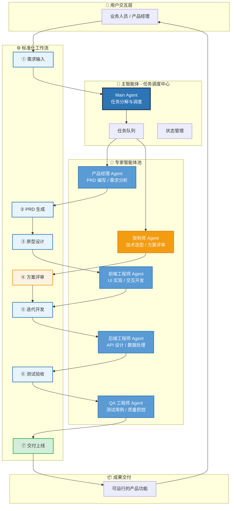

# 多智能体协同系统架构图

> AI 升级交流会汇报材料 | 从"工具"到"团队"

---

## 方案一：Mermaid 流程图（推荐，可直接嵌入 Markdown/PPT）



---

## 方案二：SVG 矢量图（适合高清投影展示）

```svg
<svg viewBox="0 0 1920 1080" xmlns="http://www.w3.org/2000/svg">
  <title>多智能体协同系统架构图</title>
  <desc>AI Agent Collaboration System Architecture for Enterprise Presentation</desc>

  <defs>
    <!-- 阴影滤镜 -->
    <filter id="shadow-sm" x="-20%" y="-20%" width="140%" height="140%">
      <feDropShadow dx="0" dy="4" stdDeviation="6" flood-opacity="0.15"/>
    </filter>
    
    <!-- 箭头标记 -->
    <marker id="arrowhead" markerWidth="12" markerHeight="12" refX="11" refY="4" orient="auto">
      <polygon points="0 0, 12 4, 0 8" fill="#2E75B6"/>
    </marker>
    
    <!-- 渐变定义 -->
    <linearGradient id="grad-main" x1="0%" y1="0%" x2="0%" y2="100%">
      <stop offset="0%" style="stop-color:#2E75B6;stop-opacity:1" />
      <stop offset="100%" style="stop-color:#1e4e8c;stop-opacity:1" />
    </linearGradient>
    
    <linearGradient id="grad-expert" x1="0%" y1="0%" x2="0%" y2="100%">
      <stop offset="0%" style="stop-color:#5B9BD5;stop-opacity:1" />
      <stop offset="100%" style="stop-color:#2E75B6;stop-opacity:1" />
    </linearGradient>
    
    <linearGradient id="grad-accent" x1="0%" y1="0%" x2="0%" y2="100%">
      <stop offset="0%" style="stop-color:#F39C12;stop-opacity:1" />
      <stop offset="100%" style="stop-color:#d68910;stop-opacity:1" />
    </linearGradient>
    
    <linearGradient id="grad-flow" x1="0%" y1="0%" x2="0%" y2="100%">
      <stop offset="0%" style="stop-color:#e8f4fd;stop-opacity:1" />
      <stop offset="100%" style="stop-color:#cce5ff;stop-opacity:1" />
    </linearGradient>
  </defs>

  <!-- 背景 -->
  <rect width="1920" height="1080" fill="#fafbfc"/>
  
  <!-- 标题 -->
  <text x="960" y="60" font-family="system-ui, -apple-system, sans-serif" font-size="36" font-weight="bold" text-anchor="middle" fill="#1a365d">
    多智能体协同系统架构
  </text>
  <text x="960" y="95" font-family="system-ui, -apple-system, sans-serif" font-size="18" text-anchor="middle" fill="#64748b">
    从"工具"到"团队"的 AI 协作范式升级
  </text>

  <!-- ========== 第一层：用户层 ========== -->
  <g transform="translate(860, 130)">
    <rect x="0" y="0" width="200" height="70" rx="12" fill="#f8f9fa" stroke="#dee2e6" stroke-width="2" filter="url(#shadow-sm)"/>
    <circle cx="50" cy="35" r="20" fill="#e9ecef" stroke="#adb5bd" stroke-width="2"/>
    <text x="50" y="42" font-family="system-ui, sans-serif" font-size="20" text-anchor="middle" fill="#495057">👤</text>
    <text x="125" y="30" font-family="system-ui, sans-serif" font-size="16" font-weight="600" fill="#212529">业务人员</text>
    <text x="125" y="52" font-family="system-ui, sans-serif" font-size="13" fill="#6c757d">产品经理</text>
  </g>

  <!-- ========== 第二层：主智能体 ========== -->
  <g transform="translate(710, 230)">
    <rect x="0" y="0" width="500" height="120" rx="16" fill="url(#grad-main)" stroke="#1a365d" stroke-width="3" filter="url(#shadow-sm)"/>
    <circle cx="80" cy="60" r="35" fill="rgba(255,255,255,0.2)" stroke="white" stroke-width="2"/>
    <text x="80" y="72" font-family="system-ui, sans-serif" font-size="28" text-anchor="middle" fill="white">🎯</text>
    <text x="280" y="45" font-family="system-ui, sans-serif" font-size="24" font-weight="bold" fill="white">Main Agent</text>
    <text x="280" y="75" font-family="system-ui, sans-serif" font-size="16" fill="rgba(255,255,255,0.9)">任务调度中心 · 智能分发 · 进度追踪</text>
  </g>

  <!-- ========== 第三层：专家池 ========== -->
  <g transform="translate(120, 380)">
    <text x="840" y="-20" font-family="system-ui, sans-serif" font-size="18" font-weight="600" text-anchor="middle" fill="#495057">专家智能体池</text>
    
    <!-- 产品经理 -->
    <g transform="translate(0, 0)">
      <rect x="0" y="0" width="180" height="100" rx="12" fill="url(#grad-expert)" stroke="#2E75B6" stroke-width="2" filter="url(#shadow-sm)"/>
      <text x="90" y="40" font-family="system-ui, sans-serif" font-size="16" font-weight="600" text-anchor="middle" fill="white">产品经理 Agent</text>
      <text x="90" y="65" font-family="system-ui, sans-serif" font-size="13" text-anchor="middle" fill="rgba(255,255,255,0.85)">PRD 编写 / 需求分析</text>
      <text x="90" y="85" font-family="system-ui, sans-serif" font-size="13" text-anchor="middle" fill="rgba(255,255,255,0.85)">竞品调研</text>
    </g>
    
    <!-- 前端工程师 -->
    <g transform="translate(340, 0)">
      <rect x="0" y="0" width="180" height="100" rx="12" fill="url(#grad-expert)" stroke="#2E75B6" stroke-width="2" filter="url(#shadow-sm)"/>
      <text x="90" y="40" font-family="system-ui, sans-serif" font-size="16" font-weight="600" text-anchor="middle" fill="white">前端工程师 Agent</text>
      <text x="90" y="65" font-family="system-ui, sans-serif" font-size="13" text-anchor="middle" fill="rgba(255,255,255,0.85)">UI 实现 / 交互开发</text>
      <text x="90" y="85" font-family="system-ui, sans-serif" font-size="13" text-anchor="middle" fill="rgba(255,255,255,0.85)">组件封装</text>
    </g>
    
    <!-- 后端工程师 -->
    <g transform="translate(680, 0)">
      <rect x="0" y="0" width="180" height="100" rx="12" fill="url(#grad-expert)" stroke="#2E75B6" stroke-width="2" filter="url(#shadow-sm)"/>
      <text x="90" y="40" font-family="system-ui, sans-serif" font-size="16" font-weight="600" text-anchor="middle" fill="white">后端工程师 Agent</text>
      <text x="90" y="65" font-family="system-ui, sans-serif" font-size="13" text-anchor="middle" fill="rgba(255,255,255,0.85)">API 设计 / 数据处理</text>
      <text x="90" y="85" font-family="system-ui, sans-serif" font-size="13" text-anchor="middle" fill="rgba(255,255,255,0.85)">数据库设计</text>
    </g>
    
    <!-- QA工程师 -->
    <g transform="translate(1020, 0)">
      <rect x="0" y="0" width="180" height="100" rx="12" fill="url(#grad-expert)" stroke="#2E75B6" stroke-width="2" filter="url(#shadow-sm)"/>
      <text x="90" y="40" font-family="system-ui, sans-serif" font-size="16" font-weight="600" text-anchor="middle" fill="white">QA 工程师 Agent</text>
      <text x="90" y="65" font-family="system-ui, sans-serif" font-size="13" text-anchor="middle" fill="rgba(255,255,255,0.85)">测试用例 / 自动化测试</text>
      <text x="90" y="85" font-family="system-ui, sans-serif" font-size="13" text-anchor="middle" fill="rgba(255,255,255,0.85)">质量把控</text>
    </g>
    
    <!-- 架构师 -->
    <g transform="translate(1360, 0)">
      <rect x="0" y="0" width="180" height="100" rx="12" fill="url(#grad-accent)" stroke="#d68910" stroke-width="2" filter="url(#shadow-sm)"/>
      <text x="90" y="40" font-family="system-ui, sans-serif" font-size="16" font-weight="600" text-anchor="middle" fill="white">架构师 Agent</text>
      <text x="90" y="65" font-family="system-ui, sans-serif" font-size="13" text-anchor="middle" fill="rgba(255,255,255,0.85)">技术选型 / 方案评审</text>
      <text x="90" y="85" font-family="system-ui, sans-serif" font-size="13" text-anchor="middle" fill="rgba(255,255,255,0.85)">性能优化</text>
    </g>
  </g>

  <!-- ========== 第四层：工作流 ========== -->
  <g transform="translate(60, 540)">
    <text x="900" y="-20" font-family="system-ui, sans-serif" font-size="18" font-weight="600" text-anchor="middle" fill="#495057">标准化工作流</text>
    
    <!-- 步骤1：需求 -->
    <g transform="translate(0, 0)">
      <rect x="0" y="0" width="120" height="80" rx="10" fill="url(#grad-flow)" stroke="#2E75B6" stroke-width="2" filter="url(#shadow-sm)"/>
      <text x="60" y="35" font-family="system-ui, sans-serif" font-size="14" font-weight="600" text-anchor="middle" fill="#1a365d">① 需求输入</text>
      <text x="60" y="58" font-family="system-ui, sans-serif" font-size="11" text-anchor="middle" fill="#64748b">业务诉求</text>
    </g>
    
    <!-- 箭头 -->
    <line x1="120" y1="40" x2="160" y2="40" stroke="#2E75B6" stroke-width="2" marker-end="url(#arrowhead)"/>
    
    <!-- 步骤2：PRD -->
    <g transform="translate(160, 0)">
      <rect x="0" y="0" width="120" height="80" rx="10" fill="url(#grad-flow)" stroke="#2E75B6" stroke-width="2" filter="url(#shadow-sm)"/>
      <text x="60" y="35" font-family="system-ui, sans-serif" font-size="14" font-weight="600" text-anchor="middle" fill="#1a365d">② PRD 生成</text>
      <text x="60" y="58" font-family="system-ui, sans-serif" font-size="11" text-anchor="middle" fill="#64748b">产品文档</text>
    </g>
    
    <!-- 箭头 -->
    <line x1="280" y1="40" x2="320" y2="40" stroke="#2E75B6" stroke-width="2" marker-end="url(#arrowhead)"/>
    
    <!-- 步骤3：原型 -->
    <g transform="translate(320, 0)">
      <rect x="0" y="0" width="120" height="80" rx="10" fill="url(#grad-flow)" stroke="#2E75B6" stroke-width="2" filter="url(#shadow-sm)"/>
      <text x="60" y="35" font-family="system-ui, sans-serif" font-size="14" font-weight="600" text-anchor="middle" fill="#1a365d">③ 原型设计</text>
      <text x="60" y="58" font-family="system-ui, sans-serif" font-size="11" text-anchor="middle" fill="#64748b">UI 交互</text>
    </g>
    
    <!-- 箭头 -->
    <line x1="440" y1="40" x2="480" y2="40" stroke="#2E75B6" stroke-width="2" marker-end="url(#arrowhead)"/>
    
    <!-- 步骤4：评审 -->
    <g transform="translate(480, 0)">
      <rect x="0" y="0" width="120" height="80" rx="10" fill="#fef3e2" stroke="#F39C12" stroke-width="2" filter="url(#shadow-sm)"/>
      <text x="60" y="35" font-family="system-ui, sans-serif" font-size="14" font-weight="600" text-anchor="middle" fill="#7c4a03">④ 方案评审</text>
      <text x="60" y="58" font-family="system-ui, sans-serif" font-size="11" text-anchor="middle" fill="#9c6b1e">技术把关</text>
    </g>
    
    <!-- 箭头 -->
    <line x1="600" y1="40" x2="640" y2="40" stroke="#2E75B6" stroke-width="2" marker-end="url(#arrowhead)"/>
    
    <!-- 步骤5：开发 -->
    <g transform="translate(640, 0)">
      <rect x="0" y="0" width="120" height="80" rx="10" fill="url(#grad-flow)" stroke="#2E75B6" stroke-width="2" filter="url(#shadow-sm)"/>
      <text x="60" y="35" font-family="system-ui, sans-serif" font-size="14" font-weight="600" text-anchor="middle" fill="#1a365d">⑤ 迭代开发</text>
      <text x="60" y="58" font-family="system-ui, sans-serif" font-size="11" text-anchor="middle" fill="#64748b">前后端实现</text>
    </g>
    
    <!-- 箭头 -->
    <line x1="760" y1="40" x2="800" y2="40" stroke="#2E75B6" stroke-width="2" marker-end="url(#arrowhead)"/>
    
    <!-- 步骤6：测试 -->
    <g transform="translate(800, 0)">
      <rect x="0" y="0" width="120" height="80" rx="10" fill="url(#grad-flow)" stroke="#2E75B6" stroke-width="2" filter="url(#shadow-sm)"/>
      <text x="60" y="35" font-family="system-ui, sans-serif" font-size="14" font-weight="600" text-anchor="middle" fill="#1a365d">⑥ 测试验收</text>
      <text x="60" y="58" font-family="system-ui, sans-serif" font-size="11" text-anchor="middle" fill="#64748b">质量保证</text>
    </g>
    
    <!-- 箭头 -->
    <line x1="920" y1="40" x2="960" y2="40" stroke="#2E75B6" stroke-width="2" marker-end="url(#arrowhead)"/>
    
    <!-- 步骤7：交付 -->
    <g transform="translate(960, 0)">
      <rect x="0" y="0" width="120" height="80" rx="10" fill="#d4edda" stroke="#28a745" stroke-width="2" filter="url(#shadow-sm)"/>
      <text x="60" y="35" font-family="system-ui, sans-serif" font-size="14" font-weight="600" text-anchor="middle" fill="#155724">⑦ 交付上线</text>
      <text x="60" y="58" font-family="system-ui, sans-serif" font-size="11" text-anchor="middle" fill="#2d7d32">产品发布</text>
    </g>
  </g>

  <!-- ========== 第五层：价值输出 ========== -->
  <g transform="translate(660, 700)">
    <rect x="0" y="0" width="600" height="100" rx="16" fill="#f8f9fa" stroke="#dee2e6" stroke-width="2" filter="url(#shadow-sm)"/>
    <text x="300" y="40" font-family="system-ui, sans-serif" font-size="20" font-weight="bold" text-anchor="middle" fill="#212529">核心价值：从 "工具" 到 "团队"</text>
    <text x="300" y="70" font-family="system-ui, sans-serif" font-size="14" text-anchor="middle" fill="#6c757d">
      不再是简单的代码生成工具，而是具备专业分工、协作能力的虚拟研发团队
    </text>
  </g>

  <!-- ========== 连接线 ========== -->
  <!-- 用户到主智能体 -->
  <line x1="960" y1="200" x2="960" y2="230" stroke="#2E75B6" stroke-width="3" marker-end="url(#arrowhead)"/>
  
  <!-- 主智能体到专家池 -->
  <line x1="960" y1="350" x2="210" y2="380" stroke="#2E75B6" stroke-width="2" stroke-dasharray="5,5"/>
  <line x1="960" y1="350" x2="550" y2="380" stroke="#2E75B6" stroke-width="2" stroke-dasharray="5,5"/>
  <line x1="960" y1="350" x2="890" y2="380" stroke="#2E75B6" stroke-width="2" stroke-dasharray="5,5"/>
  <line x1="960" y1="350" x2="1230" y2="380" stroke="#2E75B6" stroke-width="2" stroke-dasharray="5,5"/>
  <line x1="960" y1="350" x2="1570" y2="380" stroke="#F39C12" stroke-width="2" stroke-dasharray="5,5"/>
  
  <!-- 专家池到工作流 -->
  <line x1="210" y1="480" x2="240" y2="540" stroke="#5B9BD5" stroke-width="2"/>
  <line x1="550" y1="480" x2="440" y2="540" stroke="#5B9BD5" stroke-width="2"/>
  <line x1="890" y1="480" x2="720" y2="540" stroke="#5B9BD5" stroke-width="2"/>
  <line x1="1230" y1="480" x2="920" y2="540" stroke="#5B9BD5" stroke-width="2"/>
  <line x1="1570" y1="480" x2="600" y2="540" stroke="#F39C12" stroke-width="2"/>

  <!-- ========== 底部说明 ========== -->
  <text x="960" y="880" font-family="system-ui, sans-serif" font-size="14" text-anchor="middle" fill="#868e96">
    汇报对象：新能源 BP、马部、魏总（研发总经理） | 时长：30 分钟 AI 升级交流会
  </text>
</svg>
```

---

## 使用建议

### 1. PPT 插入方式
- **Mermaid**：复制 Mermaid 代码到支持 Mermaid 的 PPT 插件（如 Marp、Slidev）
- **SVG**：将 SVG 代码保存为 `.svg` 文件，直接插入 PowerPoint / Keynote

### 2. 配色说明
| 颜色 | 用途 | 色值 |
|------|------|------|
| 深蓝 | 主智能体 | `#2E75B6` |
| 浅蓝 | 专家智能体 | `#5B9BD5` |
| 橙色 | 架构师/评审节点 | `#F39C12` |
| 绿色 | 交付完成 | `#28a745` |

### 3. 演讲要点
1. **开场**：强调"从工具到团队"的理念转变
2. **核心**：Main Agent 是调度中枢，不是替代人类
3. **亮点**：专家池可按需扩展（算法工程师、运维等）
4. **价值**：标准化工作流确保交付质量可控

---

*文件路径：`/Users/tingjing/.openclaw/workspace/notes/ai-upgrade-architecture-diagram.md`*
